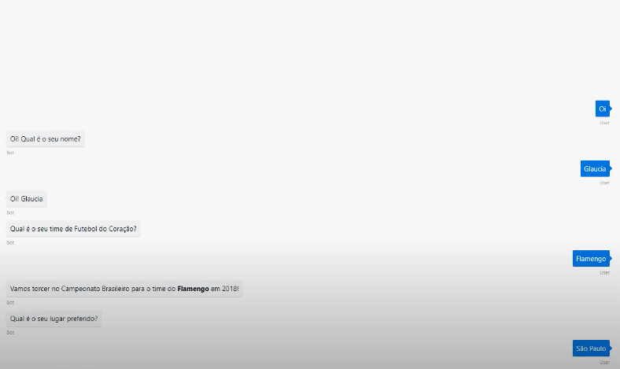

# TIME DO CORACAO
👨‍🏫PROJETO CRIADO PARA O CURSO DE MICROSOFT BOT FRAMEWORK.

 <br>

## DESCRIÇÃO:
Este bot é um exemplo básico de um chatbot construído usando o framework Bot Builder para Node.js. Ele interage com o usuário em uma sequência predefinida de diálogos:

1. **Introdução e Cumprimento:**
   - Começa cumprimentando o usuário e pedindo para informar seu nome.

2. **Pergunta sobre o Time do Coração:**
   - Após receber o nome do usuário, pergunta sobre seu time de futebol favorito para a temporada de 2018.

3. **Pergunta sobre o Lugar Preferido:**
   - Depois de saber sobre o time de futebol, pergunta qual é o lugar preferido do usuário.

4. **Respostas Personalizadas:**
   - Cada resposta do usuário é seguida por uma mensagem personalizada que confirma as informações dadas pelo usuário, como o time de futebol do coração e o lugar preferido.

## FUNCIONALIDADES:
1. **Introdução e Cumprimento:**
   - Quando iniciado, o bot cumprimenta o usuário e solicita seu nome.

2. **Pergunta sobre o Time do Coração:**
   - Após receber o nome do usuário, o bot pergunta qual é o time de futebol do coração do usuário para a temporada de 2018 no Campeonato Brasileiro.

3. **Pergunta sobre o Lugar Preferido:**
   - Depois de saber o time do coração, o bot pergunta qual é o lugar preferido do usuário.

## EXECUTANDO O PROJETO:   
1. **Instalando as Depêndencias:**
   - Para instalar as dependências listadas no arquivo "package.json", você pode usar o comando `npm install` no terminal. Certifique-se de estar no diretório do seu projeto onde o arquivo "package.json" está localizado (`CODIGO`). O npm irá ler o arquivo "package.json" e instalar todas as dependências listadas nele. 

   ```bash
   npm install
   ```

2. **Inicie o Bot:**
   - Para usar o `NODE`, inicie o bot com o seguinte comando:
    ```bash
    npm start
    ```

    - Para usar o `NODEMON`, inicie o bot com o seguinte comando:
    ```bash
    npm test
    ```

3. **Usando Ferramentas:**
   - **Localmente com o Emulador:**
   - Use o Bot Framework Emulator para se conectar ao bot em `http://localhost:3978/api/messages`.

   - **Interagindo pelo Terminal:**
   - Envie requisições POST para `http://localhost:3978/api/messages` com o corpo JSON contendo a mensagem do usuário.

4. **Interagindo com o Bot:**
   1. **Iniciar a Conversa:**
      - O bot começa pedindo ao usuário que informe seu nome. Você pode iniciar a interação respondendo com seu nome.

      **Exemplo:**
      - **Usuário:** "Oi! Meu nome é João."
      - **Bot:** "Oi, João!"

   2. **Responder sobre o Time do Coração:**
      - Em seguida, o bot perguntará sobre o time de futebol do coração do usuário para a temporada de 2018.

      **Exemplo:**
      - **Bot:** "Qual é o seu time de Futebol do Coração?"
      - **Usuário:** "Meu time do coração é Flamengo."

   3. **Responder sobre o Lugar Preferido:**
      - Depois de obter a resposta sobre o time do coração, o bot perguntará sobre o lugar preferido do usuário.

      **Exemplo:**
      - **Bot:** "Qual é o seu lugar preferido?"
      - **Usuário:** "Meu lugar preferido é Florianópolis."

   4. **Conclusão da Conversa:**
      - O bot encerrará a conversa informando sua apreciação pelo lugar mencionado pelo usuário.

      **Exemplo:**
      - **Bot:** "Amamos o Florianópolis! É simplesmente uma cidade muito bonita!"

## NÃO SABE?
- Entendemos que para manipular arquivos em muitas linguagens e tecnologias relacionadas, é necessário possuir conhecimento nessas áreas. Para auxiliar nesse aprendizado, oferecemos cursos gratuitos disponíveis:
* [CURSO DE JAVASCRIPT](https://github.com/VILHALVA/CURSO-DE-JAVASCRIPT)
* [CURSO DE NODEJS](https://github.com/VILHALVA/CURSO-DE-NODEJS)
* [CONFIRA MAIS CURSOS](https://github.com/VILHALVA?tab=repositories&q=+topic:CURSO)

## CREDITOS:
- [PROJETO CRIADO PARA O CURSO DE MICROSOFT BOT FRAMEWORK](https://github.com/VILHALVA/CURSO-DE-MICROSOFT-BOT-FRAMEWORK)
- [PROJETO FEITO PELO VILHALVA](https://github.com/VILHALVA)

